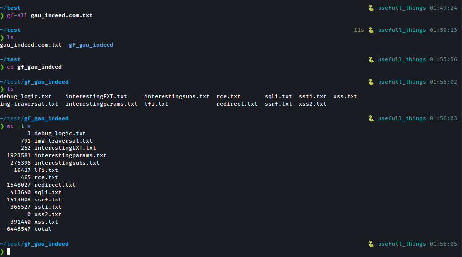

# gf-all
Run all patterns instantly and generate files.

Required tools: 
- [gau](https://github.com/lc/gau) (Gathering data about website from iot)
- [gf](https://github.com/tomnomnom/gf) (Its like grep but with patterns ideas)
- [gf-patterns](https://github.com/1ndianl33t/Gf-Patterns) (Patterns for gf)

Usage:
```sh
bash gf_all.sh gau_output.txt
```

Screenshot:


<details>
<summary>gf_all.sh</summary>
```sh
#!/usr/bin/env bash

gf_patterns='''
debug_logic
img-traversal
interestingEXT
interestingparams
interestingsubs
lfi
rce
redirect
sqli
ssrf
ssti
xss
xss2
'''

# EXPECTED FILE WHICH CONTAIN GAU OUTPUT OR SAME
main() {
  check $@
  create $1
}

check() {
  if (( $# != 1 )); then
    error "required file with gau output or same"
  fi
  path_to_file=''
  if [[ "$1" = /* ]]; then
    path_to_file=$1
  else
    path_to_file="$(pwd)/$1"
  fi
  if ! [[ -f "$path_to_file" ]]; then
    error "no such file"
  fi
}

create() {
  gf_dir="gf_$(echo $1 | rev | cut -d '/' -f 1 | rev | cut -d '.' -f 1)"
  mkdir -p "$gf_dir"
  for pattern in $gf_patterns; do
    cat $1 | gf $pattern > "$gf_dir/$pattern.txt"
  done
}

error() {
  echo "Error: $1" >&2; exit 1
}

main $@
```
</details>
